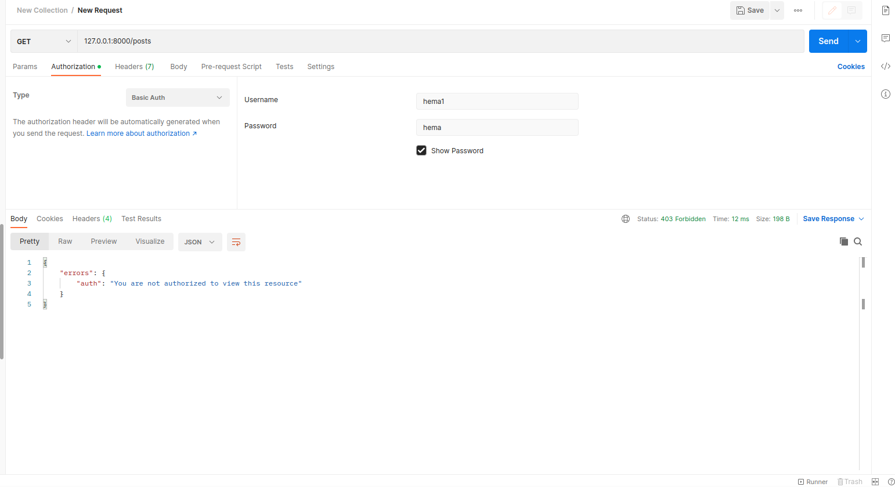
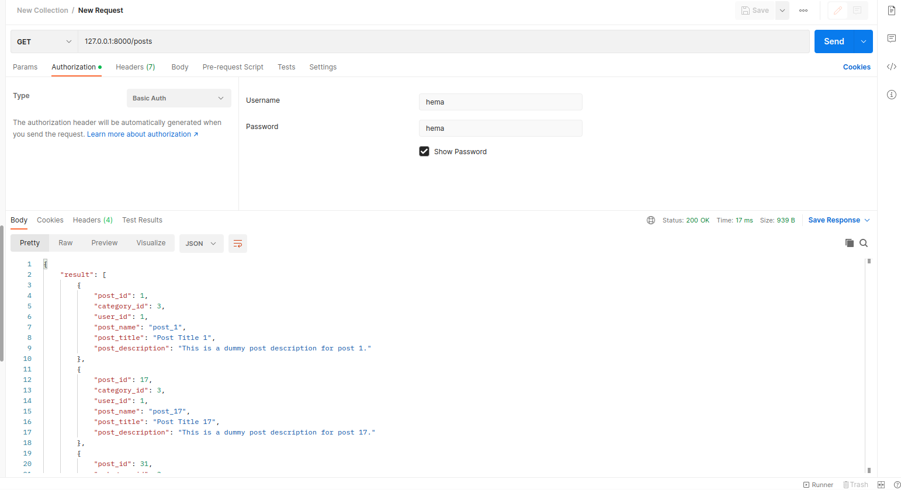

# Starlette MVC Example
In this small project we are gonna create a small rest api, using [Starlette](https://www.starlette.io/) and MVC pattern.

# Structure
- The project follows the MVC pattern.
- `models.py` is the models layer.
- `controllers.py` is the controller layer.
- `views.py` is the view layer.
- `server.py` is the application entrypoint.

# Tests
- Install requirements: `pip install -r requirements.txt`.
- To run tests `pytest tests.py`.

# Running the application
- Install requirements: `pip install -r requirements.txt`.
- Start the server: `uvicorn server:app`.
- Navigate to `/posts`, you should see an auth error and status code of 403, because of our auth middleware.

- Add a basic auth, username=hema, and password=hema, and you will see the correct result.

